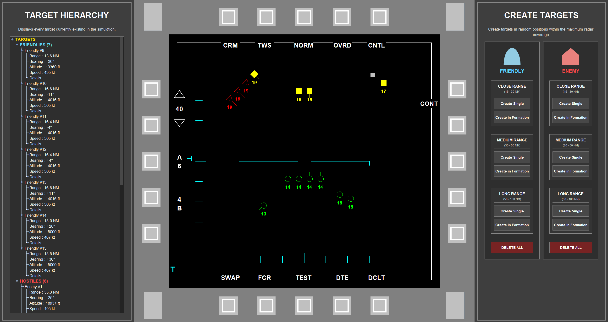

# FalconEYE

A Java-based airborne fire control radar simulation featuring an MFD-style tactical display for real-time tracking and management of simulated airborne targets.



## Features

* MFD-style tactical radar display
* Real-time visualization of simulated airborne targets
* Friendly and hostile target identification
* Target hierarchy and contact management
* Target creation at different ranges

  * Close
  * Medium
  * Long
* Single and formation target spawning
* Target information display

  * Range
  * Bearing
  * Altitude
  * Speed
* Configurable radar range
* Configurable azimuth coverage
* Configurable radar bar settings
* MFD-style OSB controls
* Responsive UI scaling for different screen resolutions

## Interface

FalconEYE is built around an MFD-style tactical interface designed to resemble an airborne radar and fire control display.

The interface consists of three main areas:

* **Target Hierarchy** — Displays and organizes detected contacts.
* **MFD Tactical Display** — Provides the primary radar visualization and target information.
* **Target Control Panel** — Allows the operator to create and manage friendly and hostile targets.

## Technology

* **Java**
* **Java Swing**
* **Java2D**
* **Object-Oriented Programming**
* **Entity Component System (ECS) architecture**

## Project Structure

The project is organized into separate packages for the application, simulation, core ECS components, and user interface.

```text
src/
├── App/
├── Core/
├── Sim/
├── UI/
└── Assets/
```

## Getting Started

### Requirements

* Windows 10/11
* Java Runtime Environment

### Running from Source

Clone the repository:

```bash
git clone https://github.com/mertkavilcioglu/FalconEYE.git
```

Open the project in an IDE such as IntelliJ IDEA and run:

```text
App.Main
```

### Running the Release

A packaged Windows application is available from the [Releases](../../releases) page.

Download the latest release, extract the application folder, and launch:

```text
FalconEYE_v1.0.exe
```

## Release

### v1.0.0 — Initial Release

The first release of FalconEYE, featuring the core radar simulation, MFD tactical display, target management system, and responsive desktop interface.

See the [v1.0.0 release](../../releases/tag/v1.0.0) for the packaged Windows application.

## Project Status

**Current Version: 1.0.0**

FalconEYE is currently in its initial release stage. Future versions may expand the simulation, tactical functionality, and operator interface.

## Author

**Mert Kavilcioğlu**

GitHub: [@mertkavilcioglu](https://github.com/mertkavilcioglu)
